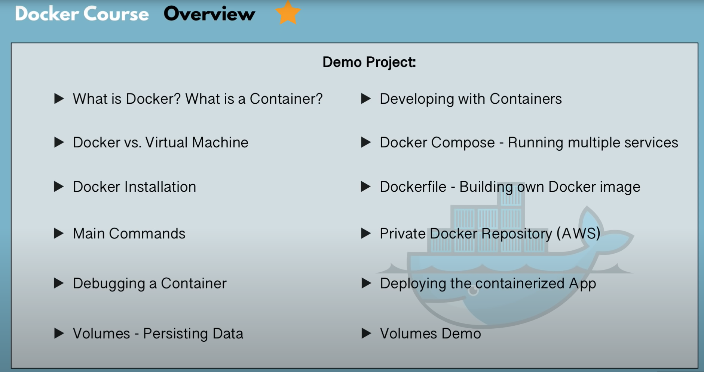
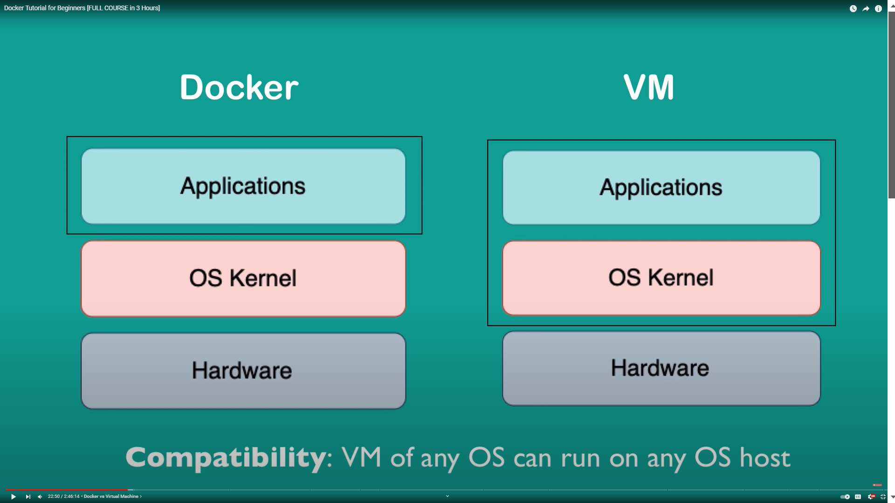

# Overview

1) What is a Container and what problems does it solve?
2) Container Repository
3) Develop application

### What is a Container?

- Container is a package application with all the necessary dependencies and configuration 
- The package is portable artifact, easily shared and moved around
- Makes development and deployement more efficient

### Where do containers live?

- Container Repository
- Private repositories
- public repository for Docker (DockerHub)

### How containers improved Application Development Process

#### Before Containers
 - Installation process different on each OS environment
 - Many steps where something could go wrong

 #### After Containers
 - inside container here has Own isolated environment 
 - Packaged with all needed configurations
 - need to run only one Docker command and fatch all has to need for this app
 - Run same app with 2 different versions

 ### How Deployement process improve

#### Before Containers
- Developmnet team create Artifacts then and Database list 
- Give to a check list to Operation team 
- then Ops team prepaer Server for this
- NOTEs: Configuration on the server needed and exteranl dependencies 
- Dependency version conflicts
- sometimes DEV vs OPS misunderstandings
- Textual guide of deployment (dificult)

#### After Container
- Developers and Operations work together to package the application in a container
- Container (Configuration + Dependencies) all together 
- no version mismatch happend
- No environmental configuration needed on server - except Docker Runtime
- Only need to Docker runtime into Server 
- then deploye docker image

### What is a Container 
- Layers of Images
- Mostly Linux Base Image, Because small in size (alpine:3.10 Layer linux base image)
- Application image on top (Postgress:10.10 Layer - application image)

### Get image from DockerHub
- it is public Repo
- No login necessary
- No Authentication
- => Docker run postgres:latest
- get postgres image for public repository
- Docker image made up by some Layers of images
- when postgres image download their has Separate images are downloaded
- Advantages of When Two speratem image version is download then Common Layer are not Downloaded again
- only different layers are downloaded
- => docker ps   (To see all running container)

### Docker Image VS Docker Container

#### Docker Image
- The actual package 
- Configuration , postgresSQL v9.3 , Start script
- Artifact, that can be moved around
- Not Running that is image Or artifacts

#### Docker Container
- when we run that image into my machine 
- Actual start the application my machine 
- container environment is created
- Running image or artifacts is Container

### Docker vs Virtual Machine
- Docker on OS level
- Different levels of abstractions
- Why linux-based docker containers don't run on Windows

#### Operating Systems have 2 Layers
- 2) Application 
- 1) OS Kernel
- Hardware

#

- Kernel communicates with hardware
- Applications run on Kernel layer

#

- Both are Virtualizaton tools

#### Docker
- Docker virtualization of Application layer

#### VM
- VM virtualtization of Application & OS Kernel Layer

#### Notes
- Size: Docker image much smaller
- Speed: Docker containers start and run much fast
- Compatibility: VM of any OS can run on any OS host

### Keypoint 
- Application (Windows) 
- Kernel      (Windows)
- Hardware
- We can not run Linux based Docker Application on windows (Because of Linux command of Kernel way diffrent of windows)
- Docker Toolbox give compatiblity to run diffirent docker application