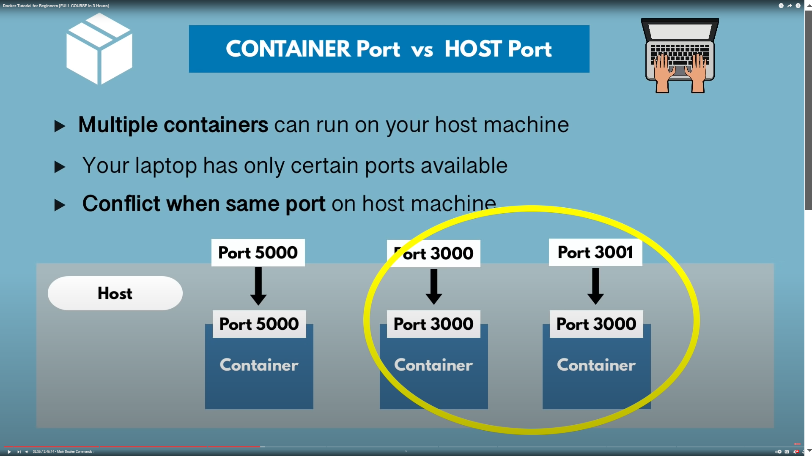

# Basic Commands

- Container vs Image
- Version and Tag
- Docker Commands
- => docker pull
- => docker run
- => docker start
- => docker stop
- => docker ps
- => docker images

### Difference Image and Container

#### pull and run 

- **Container** is a running environment for IMAGE
- Container (File system, environment configs, application image)
- port binded: talk to appliction running inside of container
- virtual file system
-  run container of redis 
- => docker run redis (pull and run this image container)
-  run the redis image into attached mode
- run into de attached mode
- => docker run -d redis
- => docker stop hasId
- => docker ps -a  (docker run history of list running and stopped container)

### Docker container port Binddings

#### Container Port vs HOST port

- -p HOST:Container port   6000 -> 6379  request forward

- It is actualy okay if port 3000 has same continer that expose port 
- But host machine can bind that port different port look 3000 and 3001 in host machine
- some-app://localhost:3001
- the host know how to forward port request to container 
- => docker run -p6000:6379 redis
- => docker run -d -p6000:6379 redis
- => docker ps -a
- => docker images 
 
### Debugging Container

- => docker logs containerID_OR_Name
- => docker exec -it (get running container cmd terminal go to file system , config other terminal power)
- => docker run -d -p60001:6379 --name redis-older redis:4.0

- => docker exec -it 0ffc4e5e3fc0 /bin/bash
    - => pwd
    - => cd /
    - => ls
    - => exit

#### docker run and docker start

- new container create by docker run command with extra parameter -p -d --name 
- then you can docker start and stop cmd use Restart the container 