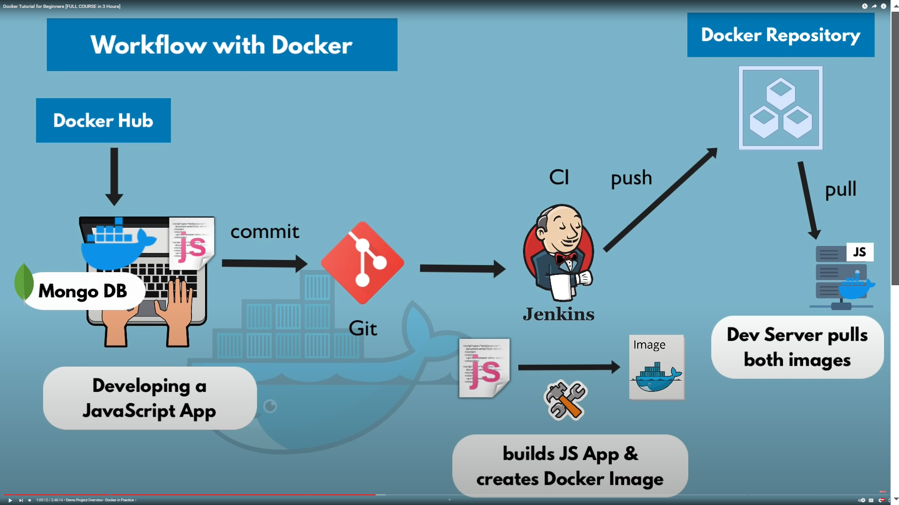

# Workflow with Docker

Docker Hub
  |
Mongo DB
  |
Developing a JavaScript App

- Then Javascript app commit into Git 
- The CI like Jenkins Create Artifactes from it
- create docker image
- publish into private Docker Repository
- This image deploye into Dev Server 
