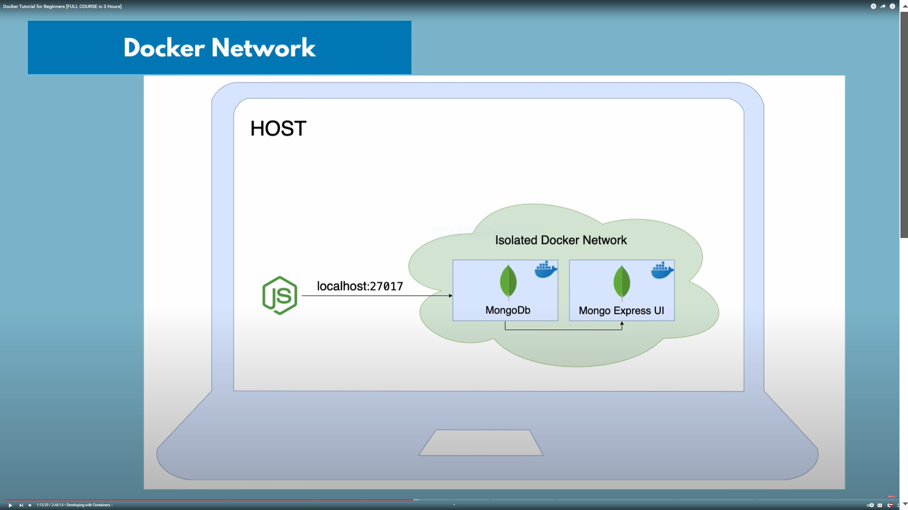
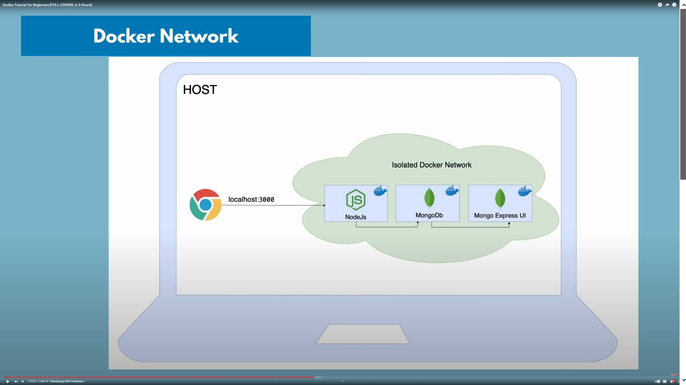

# Docker Network

### Isolated Docker Network

- In docker container runing on same machine 
- Then inside container can comunicate by 
- Docker internal name 
- without localhost or IP address needed

- host browser can comunicate by localhost:3000

- We can see some network in docker

- => docker network ls

#### we can create new network 
- => docker network create mongo-network

#### run container with this network 

- Search on docker hub to see some environmental veriable

- => docker run -d -p 27017:27017 -e MONGO_INITDB_ROOT_USERNAME=admin -e MONGO_INITDB_ROOT_PASSWORD=password --name mongodb --net mongo-network mongo

#

- Mongo Express

- => docker run -d -p 8081:8081 -e ME_CONFIG_MONGODB_ADMINUSERNAME=admin -e ME_CONFIG_MONGOD_ADMINPASSWORD=password -net mongo-netword --name mongo-express -e ME_CONFIG_MONGODB_SERVER=mongodb mongo-express

