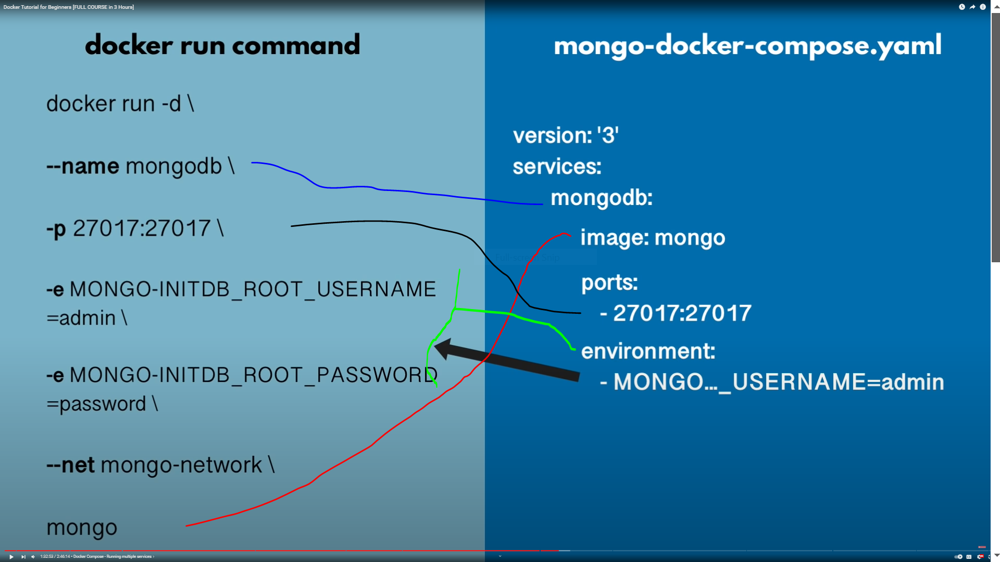
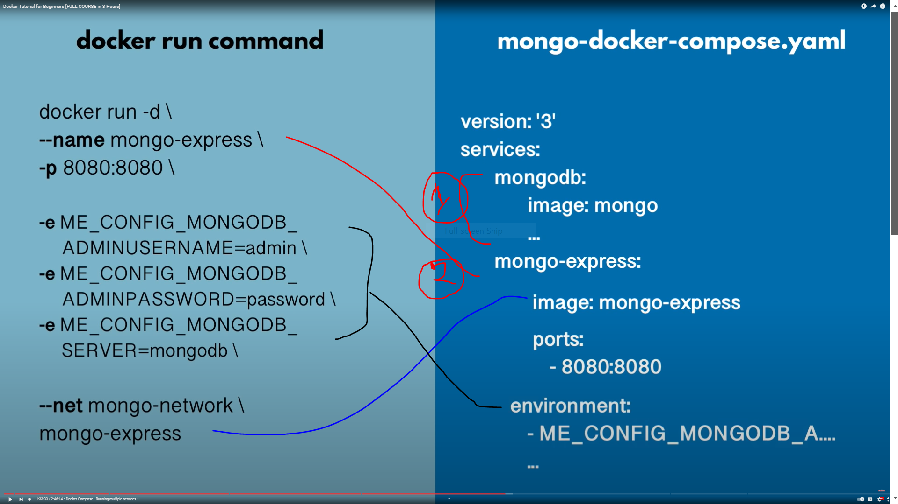

# Docker Compose

- for running multiple Docker containers

- To run docker ymal file 
- if you install docker then docker compose is already install
- docker compse want a file in our case mongo.yaml
- up command run all the container what include into yaml file 
- => docker-compose -f mongo.yaml up

- when yaml run that time one common network create and run that 
- => docker network ls

# 

- when we stop container all data are gone
- If you need persistence 
- then learn about 
- Docker Volumes for Data persistence!

#

- To down docker compose for down all compose container and related network also down
- => docker-compose -f mongo.yaml down

