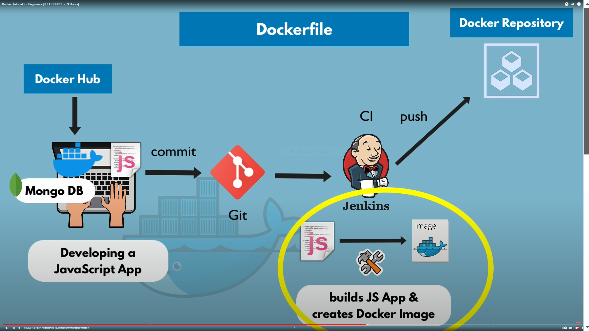
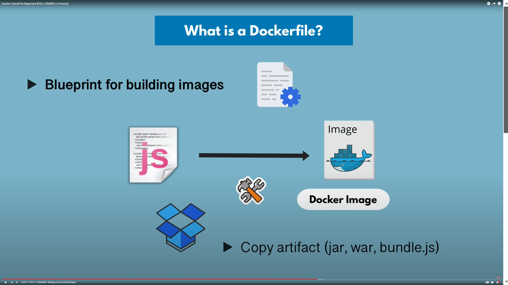
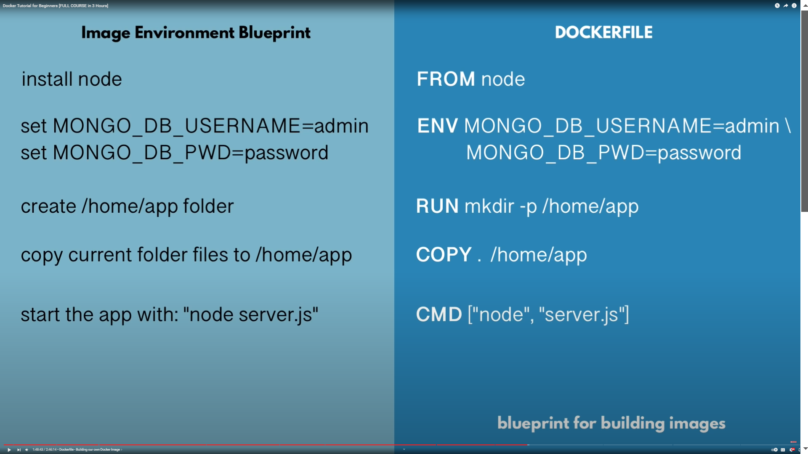

# Dockerfile

- To deploy
- build the project and upload into Docker Repository

#### what is a Dockerfile?
- Blueprint for building images
- Copy artifacte(jar, war, bundel.js)

- **FROM node** what ever image we create that based on the other image
- **ENV** optionally define the environmental variables
- **RUN** execute any Linux command
- Directory is created Inside of the container!
- **COPY** . /home/app  [copy src traget] this command - executes on the host machine
- **CMD** ["node", "server.js"]

#

- CMD = entrypoint command
- you can have multiple RUN commands

#

- build image from docker file
- => docker build -t my-app:1.0 .

- **.** mention for current directory docker file 